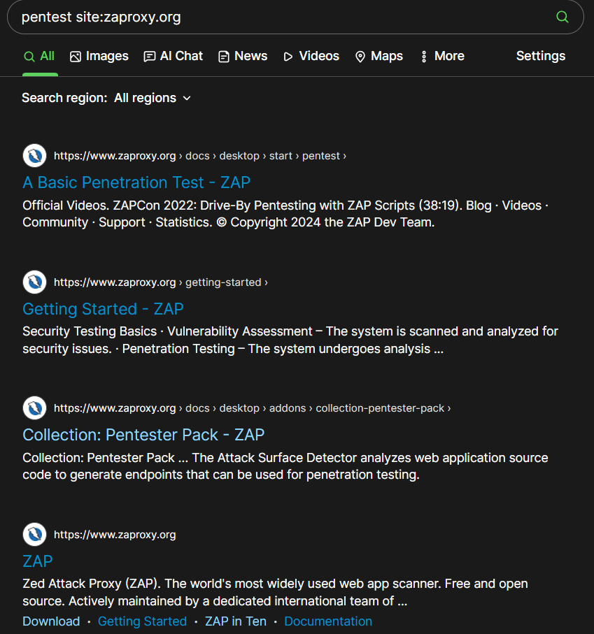
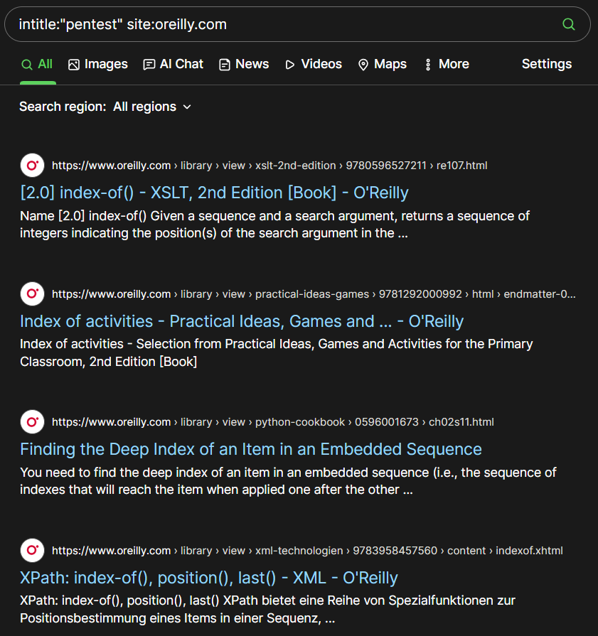
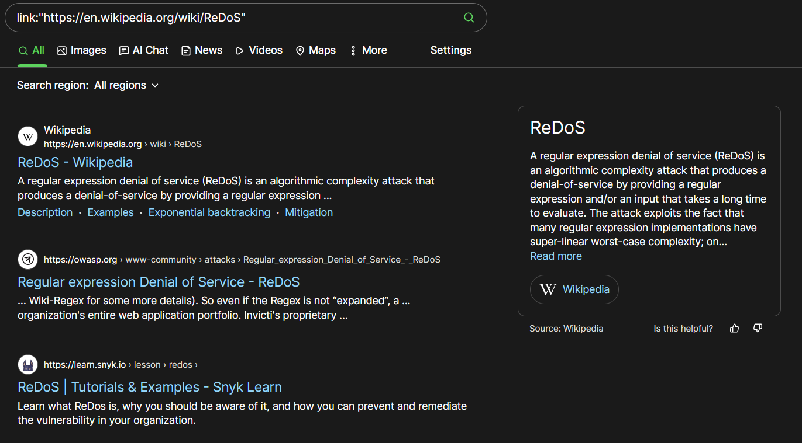
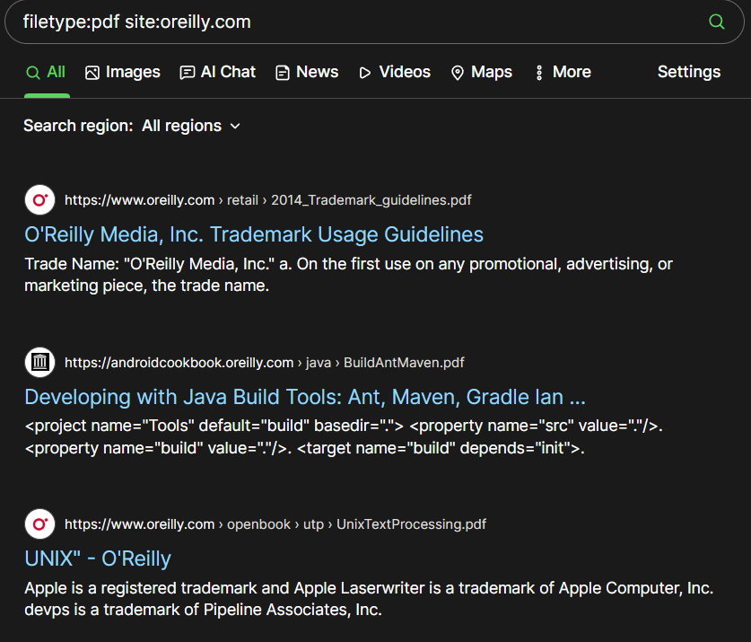

# Highlights
> Recon skills are what separate a good hacker from an ineffective one.

# Recon
## Google dorking
- **site**
    -  Show the results from a certain site only. 
    - `pentest site:zaproxy.org`
    
- **inurl**
    - Searches for pages with a URL that match the search string. 
    - `inurl:"/pentest" site:zaproxy.org`
    
- **intitle**
    - Finds specific strings in a page’s title.
    - `intitle:"pentest" site:oreilly.com`
    
- **link**
    - Searches for web pages that contain links to a specified URL.
    - `link:"https://en.wikipedia.org/wiki/ReDoS"`
    
- **filetype**
    - Searches for pages with a specific file extension.
    - `filetype:pdf site:oreilly.com`
    

---

# Reference
- [Bug Bounty Bootcamp](https://nostarch.com/bug-bounty-bootcamp) by Vickie Li, 2021