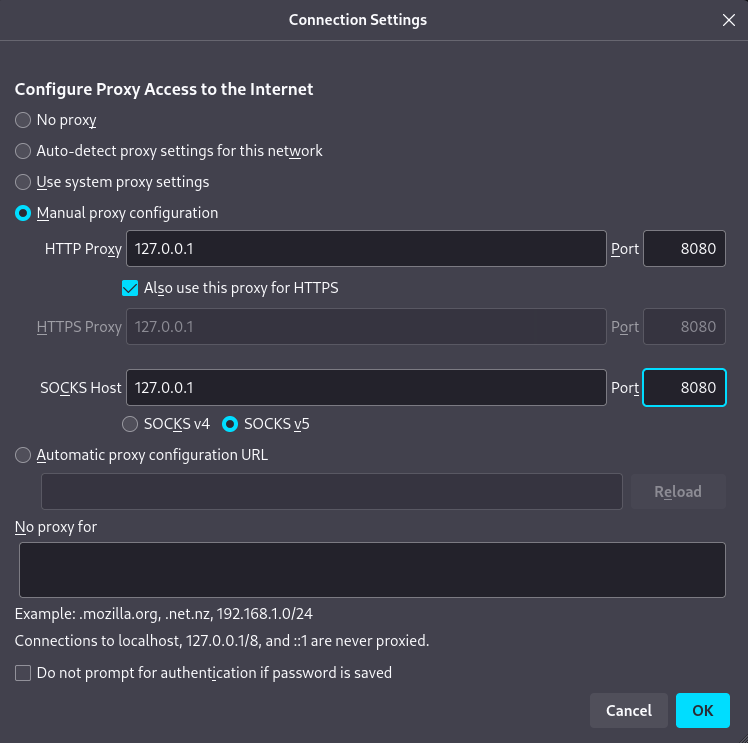
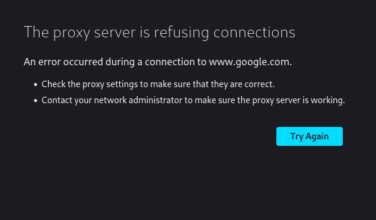
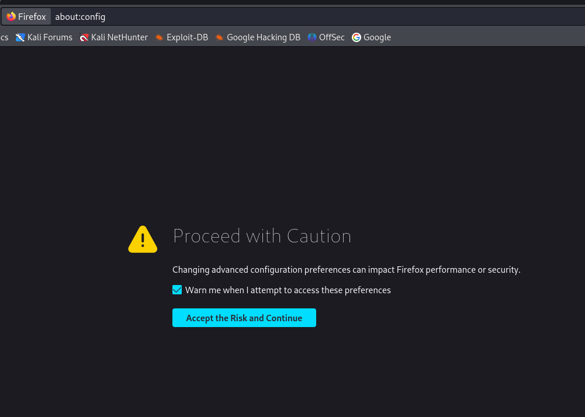
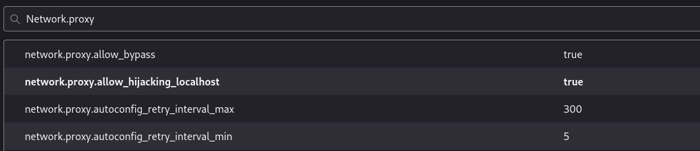
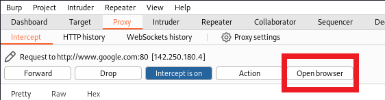
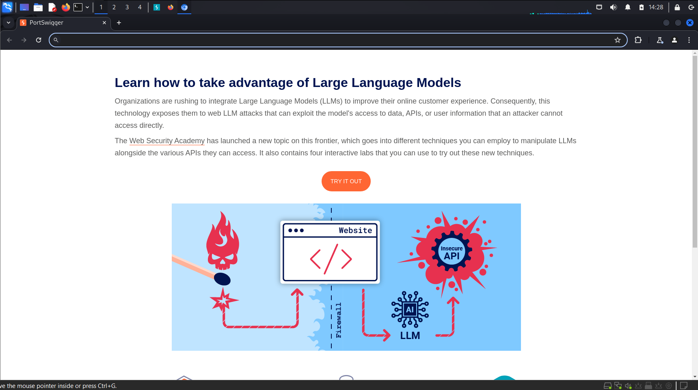
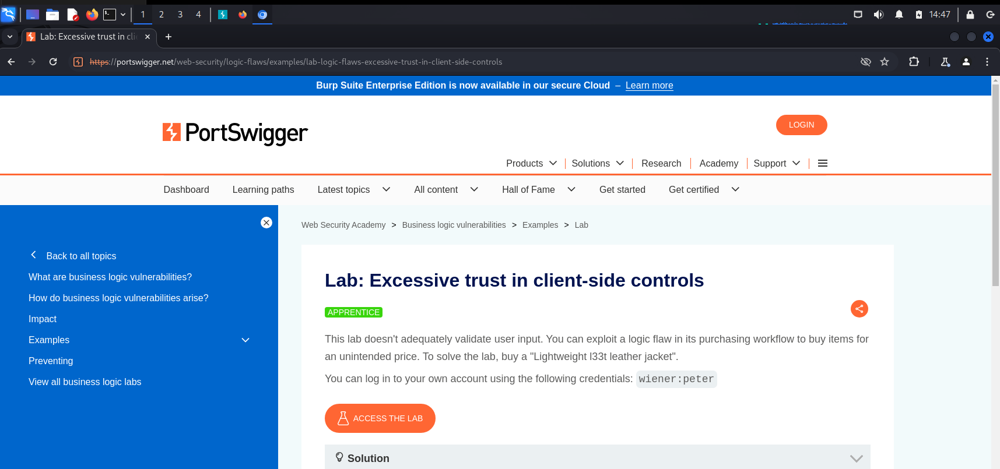

# GraphQL Security Lab
### Creating Your GraphQL Dojo: A Secure Testing Lab for GraphQL
Build a dedicated GraphQL dojo, a secure testing environment designed specifically for honing your GraphQL security skills. This lab features an array of GraphQL hacking tools and includes an intentionally vulnerable server. Here, you can safely practice and refine your offensive GraphQL techniques, ensuring you're well-prepared for real-world scenarios. <br>

### VM
- **Kali**
- Another Linux Distribution (I use Ubuntu **24.04 Desktop**) <br>

### Common commands
For Kali: <br>
```bash
sudo apt update -y
sudo apt upgrade -y
sudo apt dist-upgrade -y
```

# A browser & a proxy
More settings and details can be found in [Bug Bounty Bootcamp](https://nostarch.com/bug-bounty-bootcamp) by Vickie Li, 2021. <br>
- **Firefox** is recommended <br>
### Proxy
- Go clicking on the `setting` (top-right corner of the firefox browser) <br>
 <br>

- Scroll down to `Network Settings` <br>
 <br>
- You can use the search bar on the top too <br>
- Enable `Manual proxy configuration` to `127.0.0.1` with port `8080` for all the protocol types (This will instruct Firefox to route all of its traffic through the service running on port `8080` on your machine, using it as a proxy.) <br>
 <br>

# Burp Suite Community Version
This setting is based on the method in `Chapter 4: Environmental Setup and Traffic Interception` in  [Bug Bounty Bootcamp](https://nostarch.com/bug-bounty-bootcamp) by Vickie Li, 2021. <br>
## 1. Open Burp Suite
- Search `Burp Suite` in Kali <br>

- Click `OK`. It takes time to open `Burp Suite`. <br>
 <br>
 <br>
 <br>
 <br>
 <br>

## 2. Setup of Burp
- To intercept `HTTPS` traffic with Burp, you need to configure it to work with encrypted traffic. `HTTPS` encrypts data to ensure privacy between your browser and the server, preventing unauthorized parties, including proxies like Burp, from accessing it. To enable Burp to intercept `HTTPS` traffic, you must install Burp's `Certificate Authority` (CA) certificate in your browser (e.g., Firefox) so that the browser recognizes Burp as a trusted entity. This allows Burp to decrypt and inspect the `HTTPS` traffic. <br>
 <br>

### CA Certificate
- Open Firefox and go to `http://burp/`. <br>
 <br>

- There is a button without borders `CA Certificate` <br>
 <br>
- When you click on it, `CA Certificate` will be downloaded instantly. <br> 
 <br>

### Import Certificate
- Open `settings`, go to `Privacy & Security` on the left-hand side, then scroll down to find the section `Certificates`. <br>
 <br>

- Click on `View Certificates...` <br>
 <br>

- Go to the tab `Authorities` and click on the button `Import...` on the bottom. <br>

- Import the `CA Certificate` obtained previously, then click on `OK`. <br>
 <br>

- Restart Firefox, now Burp is set to intercept both HTTP & HTTPs traffic. <br>

**However**, I have problem to see the page afterwards. <br>
 <br>

The solution is to type `about:config` in the search bar. <br>
 <br>
Then search `network.proxy`, and double-click on the option `allow_hijacking_localhost` to `true`. <br>
 <br>

Now if you click on `open browser`, you will have this:
 <br>

 <br>

**Note** You have to make sure `inception is off` while browsing the page. <br>

Give it a try! Launch Burp's browser and visit the following URL: <br>
```
https://portswigger.net/web-security/logic-flaws/examples/lab-logic-flaws-excessive-trust-in-client-side-controls
```
 <br>


### Another Method - FoxyProxy
**FoxyProxy** is an addon for browsers, we can use for Firefox. <br>
To add a new proxy, click the `Options`. <br>
<br>
Then add a new proxy setting. <br>
Then go back to enable the proxy `Burpsuite`. <br>
<br>


## 3. View the Request
- Open Firefox and go to `google.com` <br>
- Enable `Intercept is on` (by clicking on `Intercept is off`) <br>
 <br>
- Now Burp can intercept Firefox's traffic.  <br>
 <br>
