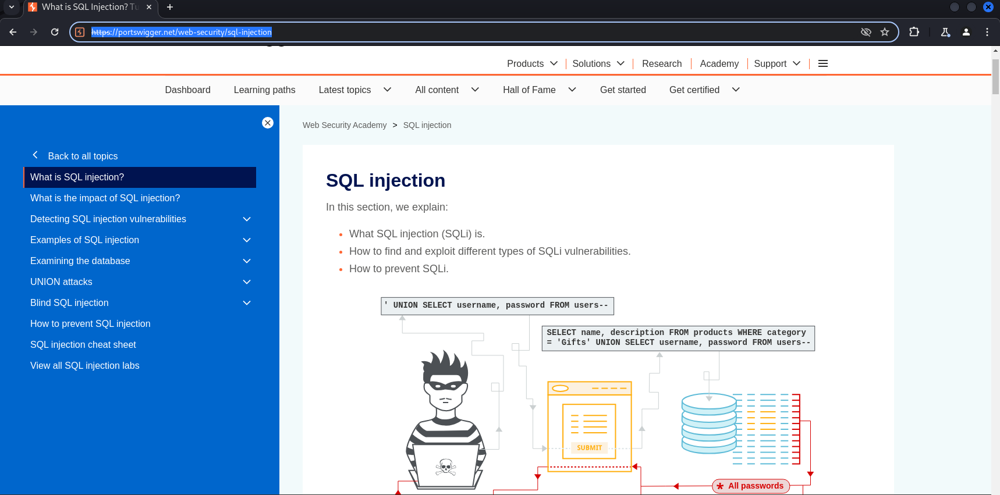

# Inspiring Quotes
 > "The best way to learn about hacking is by getting your hands dirty."
 >
 > —  [Black Hat GraphQL](https://learning-oreilly-com.ezproxy.uwe.ac.uk/library/view/black-hat-graphql/9781098156831/)

 >"Hacking is not always about finding a single vulnerability but combining several weaknesses of an application into something critical."
>
> — [Bug Bounty Bootcamp](https://nostarch.com/bug-bounty-bootcamp)

# Intro
Bug bounty programs often fall somewhere on the spectrum between black box and gray box testing ([Hacking APIs](https://nostarch.com/hacking-apis), 2022).

Bug bounty programs offer a structured yet flexible testing environment. Hunters have enough information to guide their efforts efficiently (gray box elements) while still working from an external perspective without full access to the internal workings of the application (black box elements).

# Setup of Labs
Please follow the instructions in [INSTALL.md](./INSTALL.md).

# Practice with **PortSwigger**
- There are many labs for you to practice web application security.
- After creating an account / logging in, you can start practice the labs in [PortSwigger](https://portswigger.net/web-security/sql-injection).  

---

# References
- [Black Hat GraphQL](https://nostarch.com/black-hat-graphql) By Nick Aleks, Dolev Farhi, 2023
- [Hacking APIs](https://nostarch.com/hacking-apis) By Corey Ball, 2022
- [Bug Bounty Bootcamp](https://nostarch.com/bug-bounty-bootcamp) by Vickie Li, 2021
